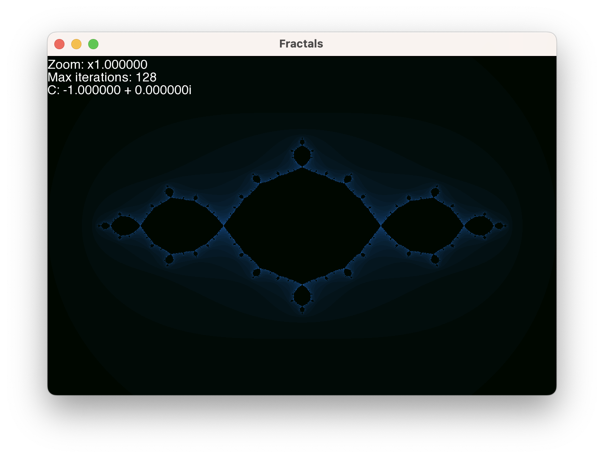
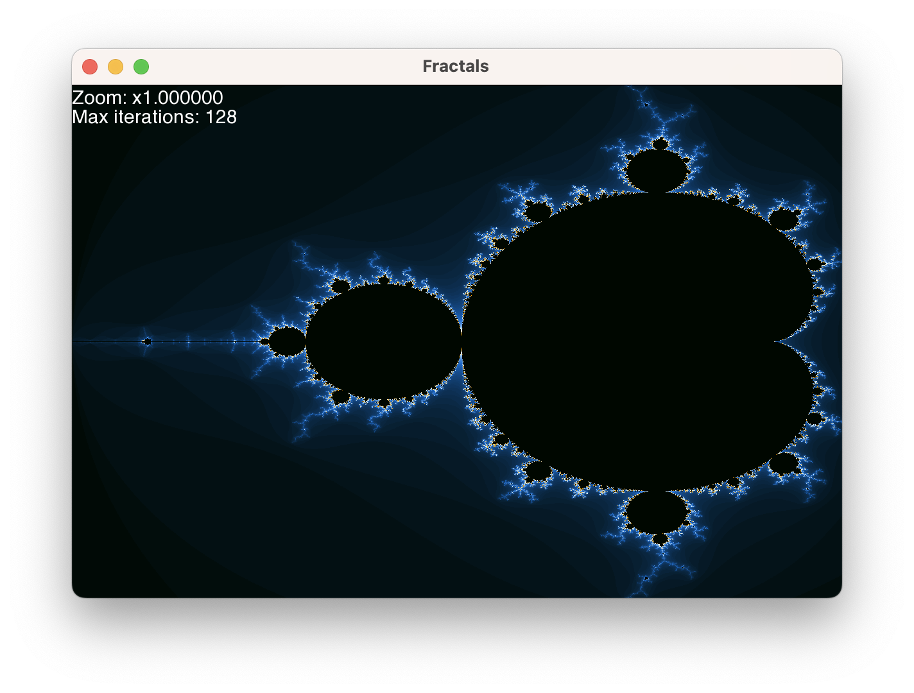
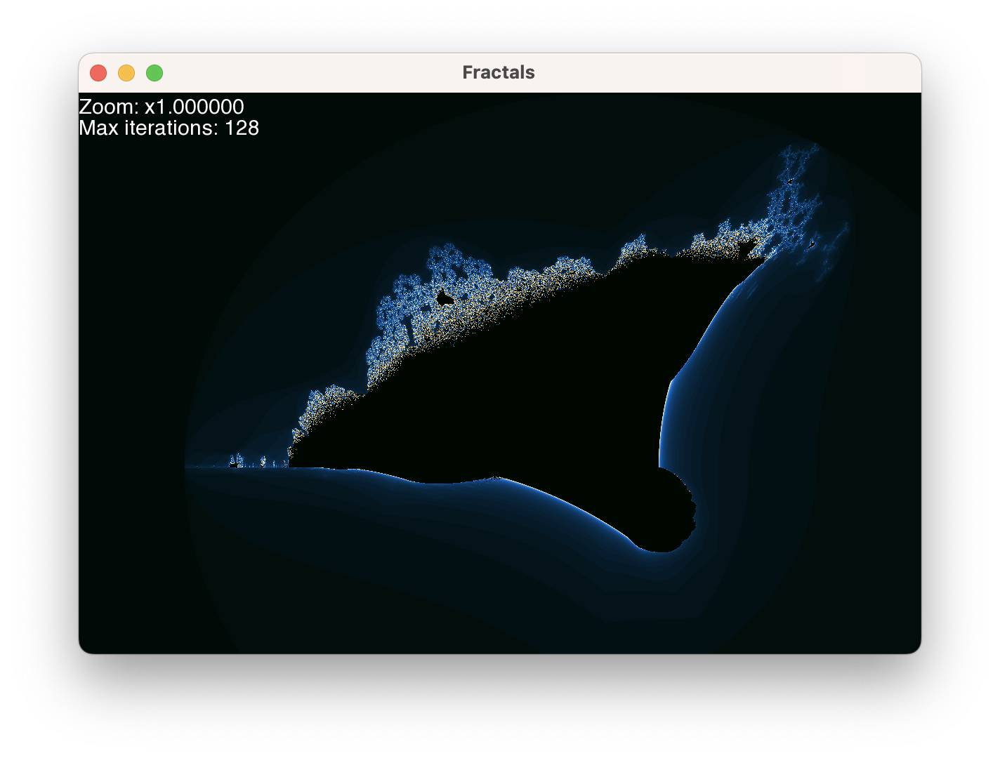
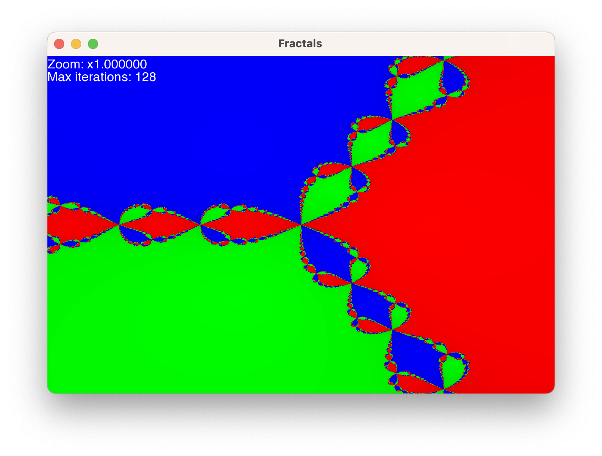

# Fractals

This project aims to generate fractals using C++ and SFML.

The fractals implemented are:

- Julia set
- Mandelbrot set
- Burning ship
- Newton fractal

It is currently available for Linux and Mac.

Further improvements are planned espacially by using OpenCL for GPU acceleration and better performances.

## How to build on Linux or Mac

### Prerequisites

- [CMake](https://cmake.org/)
- [SFML](https://www.sfml-dev.org/)
- [GCC](https://gcc.gnu.org/) or [Clang](https://clang.llvm.org/)

### Build

```bash
git clone https://github.com/valentinmougenot/Fractals.git
cd Fractals
mkdir build
cd build
cmake ..
make
```

### Run

```bash
./Fractals
```

## Usage of the program

## Interface

When you run the program, you will see the following interface:



## Controls

- `Mouse wheel` to zoom in and out
- `Left click` to increase the number of iterations
- `Right click` to decrease the number of iterations
- `Arrow keys` to move the fractal
- `O` to switch to the previous color scheme (doesn't work for the Newton fractal)
- `P` to switch to the next color scheme (doesn't work for the Newton fractal)

## Switching between fractals

You can switch between fractals by pressing the following keys:

- `J` for Julia set


- `M` for Mandelbrot set



- `B` for Burning ship



- `N` for Newton fractal


